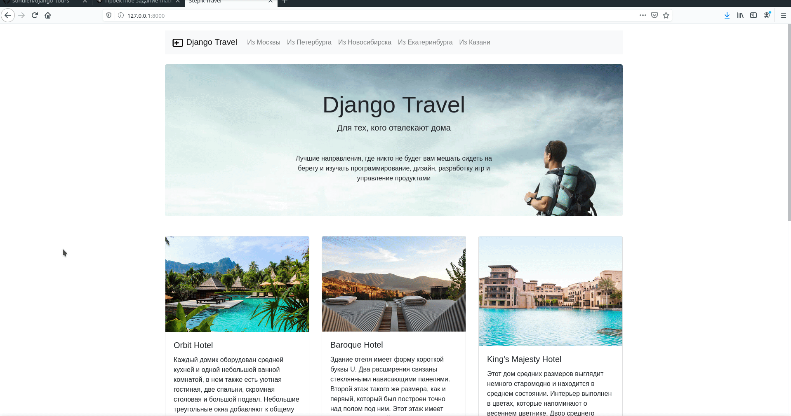

## Что реализованно

* Главная страница
* Страница туров
* Страница направлений

Все страницы пока не шаблонные, но уже есть проверка routes на наличие туров и направлений.



#### Установка проекта

- установить версию python 3.8
  
- создать виртуальное окружение 
```shell script
python3.8 -m venv venv
```

- активировать виртуальное окружение
```shell script
source venv/bin/activate
```

- установить зависимости
```shell script
pip install -r requirements.txt
```

- запустить django-проект
```shell script
./manage.py runserver
```

- открыть в браузере http://localhost:8000 
